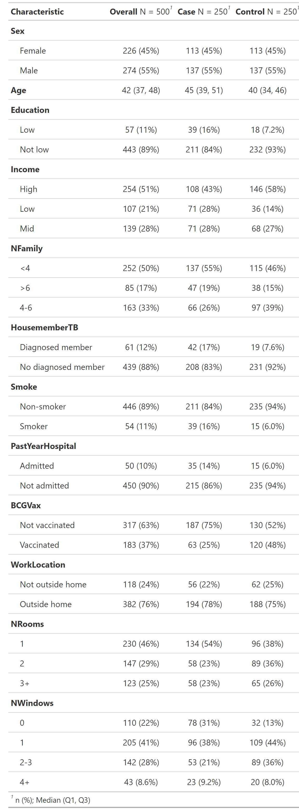

```{r setup,include=F}
# clear environment
rm(list=ls())

# setup options
knitr::opts_chunk$set(echo=FALSE, warning=FALSE, message=FALSE)
options(knitr.kable.NA = '-', digits = 2)
labs = knitr::all_labels()
labs = labs[!labs %in% c("setup", "allcode")]
```

```{r load}
## Load relevant packages
library(dplyr)      # data manipulation
library(ggplot2)    # data visualization
library(gtsummary)  # data summary
library(gt)         # save gt objects
library(broom)      # tidy tables
library(knitr)      # pretty tables

## Load data
load("../data/tbdata.RData")
tbc <- tbdata
# dim(tbc); names(tbc)

```

```{r data-cleaning, results='hide'}
#### --- Data Cleaning --- ####

## Handle missing data
anyNA(tbc)  # no missing data

## Create and modify variables
tbc <- tbc %>% dplyr::mutate(
  # create factors from categorical variables
  income = as.factor(income),
  famSize = as.factor(famSize),
  roomNo = as.factor(roomNo),
  windowNo = as.factor(windowNo),
  # create ordinal-encoding of categorical variables
  income.ord = ifelse(income == "low", 0, ifelse(income == "mid", 1, 2)),
  windowNo.ord = ifelse(windowNo == "0", 0, ifelse(windowNo == "1", 1,
                                            ifelse(windowNo == "2-3", 2, 3))))
# re-level income so "low" is the reference group
tbc$income <- relevel(tbc$income, ref = "low")

## Create a labelled data set (this is useful for plotting)
tbc_labelled <- tbc %>% mutate(
  TB = ifelse(case == 1, "Case", "Control"),
  Sex = ifelse(male == 1, "Male", "Female"),
  Age = age,
  Education = ifelse(lowEducation == 1, "Low", "Not low"),
  Income = ifelse(income == "low", "Low", ifelse(income == "mid", "Mid", 
                                                 "High")),
  NFamily = famSize,
  HousememberTB = ifelse(houseMemberTb == 1, "Diagnosed member",
                         "No diagnosed member"),
  Smoke = ifelse(smoke == 1, "Smoker", "Non-smoker"),
  PastYearHospital = ifelse(hospAdmission == 1, "Admitted", "Not admitted"),
  BCGVax = ifelse(BCGscar == 1, "Vaccinated", "Not vaccinated"),
  WorkLocation = ifelse(workOutHome == 1, "Outside home", "Not outside home"),
  NRooms = roomNo,
  NWindows = windowNo,
  .keep="none")   # only keep variables created within this mutate() call

```

## Background

Pulmonary tuberculosis (TB) is a major public health problem that impacts millions of individuals worldwide.^1^ Despite significant advancements in TB prevention and treatment, limited research has focused on how the social determinants of health impact TB.^2^ The social determinants of health, with a focus on housing conditions, may play a major role in the transmission of airborne conditions.^2,3^ In this study, we aim to evaluate the impact of the number of windows in a home as a risk factor for pulmonary TB, with the goal of informing future intervention strategies.

## Study Design

This research used secondary data from a case-control study conducted in a country with a high TB burden. The study defined cases as newly registered, bacterially confirmed incident cases of TB while controls were individuals who attended the same health care facility for non-TB related health concerns, matched to cases on sex. Information about sociodemographic factors and health behaviors was gathered from a questionnaire completed upon study enrollment. Study investigators also examined participants for the presence or absence of a characteristic scar produced by Bacille Calmette-Guérin (BCG) vaccination shown to be protective against TB.

```{r table-1}
#### --- Data Summary --- ####

## Create Table 1 summary of cases and controls
gttable1 <- gtsummary::tbl_summary(tbc_labelled, by = TB) %>%
  add_overall() %>%
  bold_labels()
# save as PNG
gttable1 %>% gtsummary::as_gt() %>% gt::gtsave("table1.png", "../images/")

```



## Statistical Methods

We aimed to model the association between pulmonary TB and housing conditions, specifically the "effect" of the number of windows on TB diagnosis. Logistic regression is suitable to provide an odds ratio (OR) associated with this variable that is adjusted to account for confounders. Higher levels of education typically result in higher earnings,^4^ both of which are independently associated with improved housing conditions^5^ and lower TB risk,^6^ which may confound our findings; thus, we included income level and indication of low education in our model. We included patient sex (binary), to obtain precision in the sex-adjusted OR estimate offered by this sex-matched sample. Income level and number of windows were treated as nominal to avoid imposing linear structures on their effects. We evaluated grouped-linear and grouped-quadratic structures for these variables.

## Results

### Logistic regression estimates

In this sex-matched study, the mean age was 44.7 years in TB cases and 40.3 years in controls; 137 (55%) participants were male. Baseline demographics are reported in Figure 1. In primary analysis, we fit a logistic regression model of the log odds of a TB diagnosis, given the number of windows in an individual's home, adjusting for sex (binary), low education status (binary), and income level (categorical). We estimate the adjusted odds ratio (AOR) of TB for homes with one window to be 0.37 times smaller than homes without windows (95% CI: 0.22-0.61). Comparing two or three window homes to homes without windows, we estimate that the AOR is 0.27 (95% CI: 0.15-0.46). We estimate the AOR between homes with four windows to those with none to be 0.58 (95%: 0.27-1.23).

```{r modeling}

#### --- Logistic regression --- ####

## Model a patient's log odds of TB from the number of windows in their home,
## adjusting for sex, low education status, and income level
mod <- glm(case ~ windowNo + male + lowEducation + income, 
           family = binomial, data = tbc)
# output model coefficients
coef <- broom::tidy(mod, conf.int = TRUE, exponentiate = TRUE) 
coef %>%
  dplyr::select(c(Term = term, OR = estimate, 'p-value' = p.value,
                  ConfLow = conf.low, ConfHigh = conf.high)) %>%
  knitr::kable(caption = "Exponentiated coefficient estimates from logistic regression",
               ndigits = 2)

```

### Evaluation

We conduct a global test of significance for the number of windows, to determine if this variable's absence has a significant impact on the likelihood of our observed outcomes, given our model. A global likelihood ratio test (LRT) determined that the number of windows is significantly associated with TB risk (LRT p \< 0.001).

```{r global-test, results='hide'}
#### --- Global test of significance of number of windows --- ####

# define null and full models
null_mod <- glm(case ~ male + lowEducation + income, 
                family = binomial, data = tbc)
full_mod <- glm(case ~ windowNo + male + lowEducation + income, 
           family = binomial, data = tbc)
# likelihood ratio test of global significance
anova(null_mod, full_mod, test="LRT")  ## LRT (3 df) p-value < 0.001

```

Model estimates suggested effects across the number of windows may follow a quadratic structure (see below); subsequent tests determined imposing a quadratic structure on these effects did not significantly improve likelihood (LRT p=0.57) and that both the final and quadratic models were an improvement over a linear effects model (LRT p\<0.001, for both tests). Effects across income levels appeared to be linear (see below), but no harm is done with our flexible, nominal encoding.

```{r assess-nonlinearity, fig.show='asis', results='hide'}

#### --- Assess non-linearity --- ####

## Effects across number of windows
# plot logit(p) across number of windows
ggplot(tbc, aes(x = windowNo, y = mod$fitted.values)) +
  geom_jitter(height = 0.01, width = 0.1, alpha = 0.5) +
  ylab("logit(p)") + xlab("Number of windows") +
  labs(title = "Scatterplot of adjusted log odds of TB by number of windows",
       subtitle = "Slight jitter added to show all observations.") +
  theme_bw()

## Effects across income levels
# plot logit(p) across income level
ggplot(tbc, aes(x = income.ord, y = mod$fitted.values)) +
  geom_jitter(height = 0.01, width = 0.1, alpha = 0.5) +
  ylab("logit(p)") + xlab("Income level") +
  labs(title = "Scatterplot of adjusted log odds of TB by income levels",
       subtitle = "Slight jitter added to show all observations.") +
  theme_bw()

## LRT for quadratic association between number of windows and log odds of TB
# no structure imposed on effects
flex_mod <- glm(case ~ windowNo + male + lowEducation + income, 
                family = binomial, tbc)
# linear structure imposed on effects
lin_mod <- glm(case ~ windowNo.ord + male + lowEducation + income, 
               family = binomial, tbc)
# quadratic structure imposed on effects
quad_mod <- glm(case ~ poly(windowNo.ord,2) + male + lowEducation + income, 
                family = binomial, tbc)
# separate LRT to compare flexible, linear, and quadratic models
anova(lin_mod, flex_mod, test = "LRT")   # LRT (2 df) p-value < 0.001 
anova(lin_mod, quad_mod, test = "LRT")   # LRT (1 df) p-value < 0.001 
anova(quad_mod, flex_mod, test = "LRT")  # LRT (1 df) p-value = 0.57 

```

Model estimates do not suggest effect modification from sex, income level, or low education status (see below).

```{r assess-moderation, fig.asp=0.5}

#### --- Assess effect moderation --- ####

# plot logit(p) across number of windows, by sex
ggplot(tbc, aes(x = windowNo, y = mod$fitted.values, col = as.factor(male))) +
  geom_jitter(height = 0.01, width = 0.1, alpha = 0.5) +
  ylab("logit(p)") + xlab("Number of windows") +
  labs(title = "Scatterplot of adjusted log odds of TB vs number of windows, \n by sex") +
  theme_bw()

# plot logit(p) across number of windows, by income level
ggplot(tbc, aes(x = windowNo, y = mod$fitted.values, col = income)) +
  geom_jitter(height = 0.01, width = 0.1, alpha = 0.5) +
  ylab("logit(p)") + xlab("Number of windows") +
  labs(title = "Scatterplot of adjusted log odds of TB vs number of windows, \n by income level") +
  theme_bw()

# plot logit(p) across number of windows, by low education
ggplot(tbc, aes(x = windowNo, y = mod$fitted.values, col = as.factor(lowEducation))) +
  geom_jitter(height = 0.01, width = 0.1, alpha = 0.5) +
  ylab("logit(p)") + xlab("Number of windows") +
  labs(title = "Scatterplot of adjusted log odds of TB vs number of windows, \n by education status") +
  theme_bw()
```

## Discussion

In our case-control study, after adjusting for believed confounders, the odds of TB for patients living in homes without windows did not differ significantly from those with four or more windows, although both odds were higher than those with one to three windows. A possible explanation is that the AOR of TB relies on family size, which may be similar in groups with comparable risk. Strengths of this study include the sex-matched case-control design for our rare outcome, pulmonary TB, and available data on socioeconomic and clinically relevant covariates. However, important limitations must be acknowledged. Self-reported measures of covariates may be biased. Additionally, data on additional quantitative clinical and hospitalization covariates such as laboratory parameters and pre-existing lung disease were not available and may influence TB risk. Further research is needed to fully explore the impact of ventilation on pulmonary TB risk and transmission.

## References

1.  Bagcchi S. WHO's Global Tuberculosis Report 2022. The Lancet Microbe. 2023;4(1):e20. [doi:10.1016/S2666-5247(22)00359-7](doi:10.1016/S2666-5247(22)00359-7){.uri}

2.  Wingfield T, Tovar MA, Huff D, et al. Beyond pills and tests: addressing the social determinants of tuberculosis. Clin Med. 2016;16(Suppl 6):s79-s91. <doi:10.7861/CLINMEDICINE.16-6-S79>

3.  Prüss-Ustün A, Wolf J, Corvalán C, Neville T, Bos R, Neira M. Diseases due to unhealthy environments: an updated estimate of the global burden of disease attributable to environmental determinants of health. J Public Health (Oxf). 2016;39(3):464. <doi:10.1093/PUBMED/FDW085>

4.  Earnings by educational attainment \| OECD. <https://www.oecd.org/en/topics/sub-issues/earnings-by-educational-attainment.html>. Accessed November 17, 2024.

5.  Quality of Housing - Healthy People 2030 \| odphp.health.gov. <https://odphp.health.gov/healthypeople/priority-areas/social-determinants-health/literature-summaries/quality-housing>. Accessed November 15, 2024.

6.  Barter DM, Agboola SO, Murray MB, Bärnighausen T. Tuberculosis and poverty: the contribution of patient costs in sub-Saharan Africa -- a systematic review. BMC Public Health. 2012;12(1):980. <doi:10.1186/1471-2458-12-980>

**End of report. Code appendix begins on the next page.**

\pagebreak

## Code Appendix

```{r allcode, ref.label = knitr::all_labels(), echo=TRUE, eval=FALSE}
```

**End of document.**
