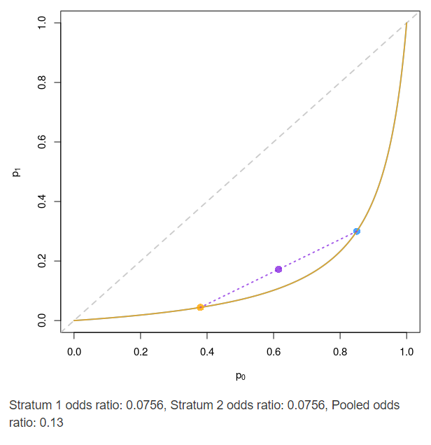

```{r setup, include=F}
# clear environment
rm(list=ls())

# setup options
knitr::opts_chunk$set(echo = FALSE, message = FALSE)
options(knitr.kable.NA = '-')
ndigits = 3
options(digits = ndigits)
labs = knitr::all_labels()
labs = labs[!labs %in% c("setup", "llm_appendix", "allcode")]
```

```{r load-libraries-data, include=F}
# load relevant packages
library(dplyr)      # data frame manipulation
library(gtsummary)  # table summaries
library(dagR)       # DAG simulation
library(broom)      # model coefficient table
library(knitr)      # pretty tables

# load data
sbias <- read.csv("../data/sexbias.csv")
sbias <- sbias %>% select(-1) %>% mutate_all(as.factor)

asbt <- read.csv("../data/asbestos.csv") 
asbt <- asbt %>% select(-1) %>% mutate_all(as.factor)
```

## Hypothetical Pharmacuetical Trial

1. A pharmaceutical company has run a randomized controlled trial of a drug intended for patients with symptomatic infection to prevent progression to severe disease.  Assume that males with symptomatic infection are substantially more likely to progress to severe disease than females.  In the trial, treatment vs. placebo was randomly assigned, with males and females each evenly divided between the treatment vs. placebo groups.  You can also assume the treatment is effective – it does reduce the chances of severe disease.

a. Suppose the company chooses to summarize results with OR, and that the OR in males is the same as the OR in females.  If the marketing department wants to make their drug look as impressive as possible, would they prefer the crude OR or the sex-adjusted OR?  Why?

They would prefer the sex-adjusted OR, because the crude/pooled OR is closer to 1, suggesting a weaker treatment effect than the adjusted OR. Below is an illustration of this example, where strata 1 and 2 have the same OR and the pooled OR is *attenuated* (reduced in effect) in comparison. See a comparable example in Figure 1, where risk of disease is higher in one strata than the other.  

{width=40%}

b. Which measure would you prefer for summarizing the effect of the treatment?  RR, RD, or OR?  Explain briefly.

I like relative risk because it's a clear metric how much more the risk of disease is between the treated and untreated groups.
I also like the language "reduce your risk by #%" that a risk difference allows.

## Parameters of Logistic Regression

2. A major public research university has been accused of discriminating against women in admission to its graduate programs.  A task force randomly selects 6 graduate programs (“majors”) from across the university to investigate the question. Use the dataset `sexbias` to investigate the following.

```{r question-2}

## ===============
## Question 2
## ===============
sbias %>%
  dplyr::mutate(ACCEPT = ifelse(ACCEPT=="no", "Not accepted", "Accepted")) %>%
  gtsummary::tbl_summary(by = ACCEPT,
                         label = list(SEX="Sex", MAJOR="Major")) %>%
  add_overall() %>%
  bold_labels()
```

a. For the three variables in the dataset, draw a DAG representing the most appropriate scientific model to approach the question.

```{r question-2a, fig.asp=1}
dag <- dagR::dag.init(covs = 1, arcs = c(0, 1, 1, 2),
                      y.name = "Acceptance", x.name = "Sex", 
                      cov.names = "Major") %>% 
  dag.draw()
```

b. Use logistic regression to examine the unadjusted association between sex and acceptance to graduate school. Summarize the results in language suitable for the task force’s report.

```{r question-2b}
mod.lr <- glm(data=sbias, ACCEPT ~ SEX, family=binomial()) %>%
  broom::tidy(exponentiate = TRUE, conf.int = TRUE) %>%
  mutate_if(is.numeric, round, ndigits)
# knitr::kable(mod.lr)
```

We estimate that the odds of acceptance to these graduate programs is `r mod.lr[2,2]` times greater for males compared to females (95% CI for odds ratio: `r mod.lr[2,6]`-`r mod.lr[2,7]`).

This model suggests that male students have statistically significant higher chances of admission to these programs. Within our group of selected programs, it would be unusual to observe female students as being equally or more likely to be accepted than males students.

c. Use logistic regression to examine the association between sex and acceptance to graduate school adjusted for “major”. Summarize the results in language suitable for the task force’s report.

```{r}
mod.lr2 <- glm(data=sbias, ACCEPT ~ SEX + MAJOR, family=binomial()) %>%
  tidy(exponentiate = TRUE, conf.int = TRUE) %>%
  mutate_if(is.numeric, round, ndigits)
# kable(mod.lr2)
```

We estimate that the major-adjusted odds of acceptance to these graduate programs is `r mod.lr2[2,2]` times greater for males compared to females (95% CI for odds ratio: `r mod.lr2[2,6]`-`r mod.lr2[2,7]`).

This model suggests that within a single major from our sample, male students do not have a statistically significant higher chance of admission than females students. In fact, across the six programs considered, it is common to observe either sex having slightly higher chances of acceptance (note: this statement reflects as an average over our six programs). 

d. Are the results from b and c very different?  Why or why not? (Don’t answer in general terms, answer in terms of this dataset.)

The two models lead to different conclusions. One suggests- with certainty- male students are more likely to be accepted than female students, while the other accounts for either sex to enjoy higher acceptance rates within a given major with equal certainty.

The key difference between the models is what they consider as influencing odds of acceptance. The first model only considers sex, while the second includes both sex and major. The first estimates the overall effect of sex, while the second estimates the effect of sex within a single major. However, the second model combines effects across our six majors, which may misrepresent the effect of sex if it varies between majors.

e. Which analysis best addresses the question of whether the University discriminates against women in graduate school admissions?

The second model considers major to estimate the effect of sex on the odds of acceptance. Since acceptance rates and sex imbalance are each associated with major, I prefer the second model. Still, because I believe the effect of sex to differ between majors, I propose a third model that allows major to be an effect modifier on the effect of sex on odds of acceptance.

f. Is there any other information you would have liked to have had for this analysis (e.g. any unmeasured potential confounders)?

There are many potential confounders that may influence our measured effect of sex on acceptance within our subset of six majors. For example, a student's sex may affect their extracurricular activities and, down the line, their chances of acceptance.

## Logistic Regression with Interaction

3. The course CANVAS site has a file of (fictitious) data from a case-control study of lung-cancer examining two exposures, smoking and asbestos.  Asbestos is the exposure of interest.  Fit a logistic regression model with a main effect for asbestos exposure, a main effect for smoking, and an interaction term for asbestos exposure and smoking.  (This is “model A” in lecture 4.)

```{r question-3}

## ===============
## Question 3
## ===============
asbt %>%
  mutate(LUNGCA = ifelse(LUNGCA=="No", "No lung cancer", "Lung cancer")) %>%
  tbl_summary(by = LUNGCA,
              label = list(ASBESTOS="Asbestos", SMOKE="Smoke")) %>%
  bold_labels()

mod.lr3 <- glm(data=asbt, LUNGCA ~ ASBESTOS * SMOKE, family=binomial()) %>%
  tidy(exponentiate = TRUE, conf.int = TRUE) %>%
  mutate_if(is.numeric, round, ndigits)
# kable(mod.lr3)
```

a. For each of the four regression parameters in the model:  what population quantity does the parameter estimate?  If the parameter does not estimate a population quantity, briefly explain why.

From class we derived that the form of a logistic model from a case-control study is

$log(odds[L=1|A,S]) = log(\pi) + \beta_0 + \beta_1 \cdot A + \beta_2 \cdot S + \beta_3 \cdot S \cdot A$

which is the classic form, aside from $log(\pi)$, an unknown measure of how much more likely a case in the population (a person with lung cancer) is to be sampled than a control (a person without lung cancer). Then,

- the intercept $log(\pi) + \beta_0$ cannot be interpreted classically and does not estimate a population quantity 

- $\hat \beta_1$ estimates the odds ratio associated with asbestos within the non-smoking population

- $\hat \beta_2$ estimates the adjusted odds ratio associated with smoking within the unexposed population

- $\hat \beta_3$ estimates how much greater the odds ratio associated with asbestos is within the smoking population than the non-smoking population and, equally, how much greater the odds ratio associated with smoking is within those exposed to asbestos compared to those unexposed

b. According to the fitted model, what is the OR for asbestos among non-smokers?

We estimate that the odds of non-smokers having lung cancer is `r mod.lr3[2,2]` times greater for those exposed to asbestos compared to those unexposed to asbestos (95% CI for odds ratio: `r mod.lr3[2,6]`-`r mod.lr3[2,7]`).

c. According to the fitted model, what is the OR for asbestos among smokers?

We estimate that the odds of smokers having lung cancer is `r round(mod.lr3[2,2]*mod.lr3[4,2], ndigits)` times greater for those exposed to asbestos compared to those unexposed to asbestos (95% CI for odds ratio: `r round(mod.lr3[2,6]*mod.lr3[4,6], ndigits)`-`r round(mod.lr3[2,7]*mod.lr3[4,7], ndigits)`).

d.  Summarize the evidence that smokers and non-smokers have different ORs for asbestos. Write your answer in a few sentences suitable for a scientific publication.

We estimate the effect of exposure to asbestos on odds of having lung cancer to differ between a smoking and non-smoking population by `r mod.lr3[4,2]` times (95% CI for effect modification: `r mod.lr3[4,6]` - `r mod.lr3[4,7]`). This model suggests that the smoking population has an effect of asbestos on lung cancer that is `r mod.lr3[4,2]` times stronger than the non-smoking population.

e. One could instead estimate the OR for asbestos among smokers by fitting a simple logistic regression model using the subset of the data on smokers. Do this. Compare your point estimates and confidence intervals here and part c and comment on whether any similarities or differences are to be expected.

```{r}
mod.lr4 <- glm(data = subset(asbt, SMOKE=="Yes"),
               LUNGCA ~ ASBESTOS, family=binomial()) %>%
  tidy(exponentiate = TRUE, conf.int = TRUE) %>%
  mutate_if(is.numeric, round, ndigits)
# kable(mod.lr4)
```

We estimate that the odds of non-smokers having lung cancer is `r mod.lr4[2,2]` times greater for those exposed to asbestos compared to those unexposed to asbestos (95% CI for odds ratio: `r mod.lr4[2,6]`-`r mod.lr4[2,7]`).

Compared to the model from Part C, the point estimates are the same, but the CI is notably narrower-- I am uncertain as to why.

f. Use an appropriate logistic regression model to estimate the smoking-adjusted OR for asbestos. Compare your results with b and c above.

```{r}
mod.lr5 <- glm(data=asbt, LUNGCA ~ ASBESTOS + SMOKE, family=binomial()) %>%
  tidy(exponentiate = TRUE, conf.int = TRUE) %>%
  mutate_if(is.numeric, round, ndigits)
# kable(mod.lr5)
```
We estimate the odds of having lung cancer, between two populations who are of the same smoking status, to be `r mod.lr5[2,2]` times greater among those exposed to asbestos compared to those unexposed to asbestos (95% CI for odds ratio: `r mod.lr5[2,6]`-`r mod.lr5[2,7]`).

g. For the model in part f, perform a test of the null hypothesis that the smoking-adjusted odds ratio is 1.

This model suggests that the smoking-adjusted odds ratio associated with exposure to asbestos to be statistically significant. It would be common to observe the odds of having lung cancer as being `r mod.lr5[2,6]`-`r mod.lr5[2,7]` times greater for people exposed to asbestos compared to those unexposed to asbestos, controlling for smoking status.

**End of report. Code appendix begins on the next page.**

\pagebreak

## Code Appendix

```{r allcode, ref.label = knitr::all_labels(), echo=TRUE, eval=FALSE}
```

**End of document.**
